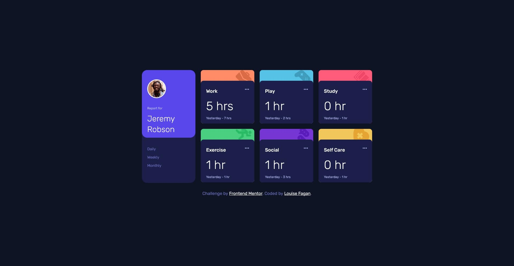

# Frontend Mentor - Time tracking dashboard solution

This is a solution to the [Time tracking dashboard challenge on Frontend Mentor](https://www.frontendmentor.io/challenges/time-tracking-dashboard-UIQ7167Jw). Frontend Mentor challenges help you improve your coding skills by building realistic projects.

## Table of contents

- [Overview](#overview)
  - [The challenge](#the-challenge)
  - [Screenshot](#screenshot)
  - [Links](#links)
- [My process](#my-process)
  - [Built with](#built-with)
  - [What I learned](#what-i-learned)
  - [Continued development](#continued-development)
- [Author](#author)

## Overview

Time tracking Dashboard is a front end mentor challenge that I decide to do to brush up on my grid and javascript skills.

### The challenge

Make a time tracking dashboard according to the specifications. Get info from a json file to fill the information.

Users should be able to:

- View the optimal layout for the site depending on their device's screen size
- See hover states for all interactive elements on the page
- Switch between viewing Daily, Weekly, and Monthly stats

### Screenshot

### Links

- Solution URL: [https://github.com/LouFagan/time-tracking-dashboard.loufagan.github.io](https://your-solution-url.com)
- Live Site URL: [https://loufagan.github.io/time-tracking-dashboard.loufagan.github.io/](https://your-live-site-url.com)

## My process

Started developping the full size first then I moved on to the mobile version because it made more sense to me to do it that way.

### Built with

- Semantic HTML5 markup
- CSS custom properties
- Flexbox

- CSS Grid

### What I learned

I learned a little bit more about grid and how to place objects in a grid. I struggled with the javascript a bit because I was trying to find a way to loop through the Daily, Weekly and Monthly and show the json data according to the result of the click but I wasn't able to do it that way so I had to do 3 separate fetch calls instead of just one.

### Continued development

Definitely need more practice with grid and javascript.

## Author

- Website - [Louise Fagan](https://www.pixelmein.ca)
- Frontend Mentor - [@LouFagan](https://www.frontendmentor.io/profile/LouFagan)
